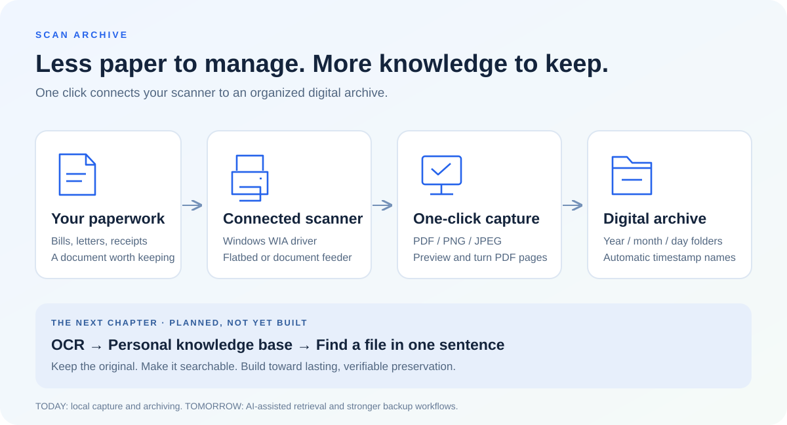
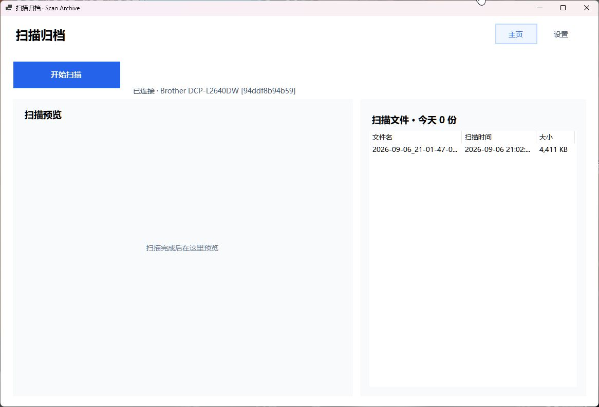

<h1 align="center">Scan Archive</h1>

<p align="center">Too much paper. Too much time spent searching.<br/>One click to scan, preview, and file your documents—one step toward a personal knowledge base.</p>

<p align="center"><strong>English</strong> · <a href="README.zh-CN.md">简体中文</a></p>

<p align="center">Windows desktop · C# / .NET 10 · WIA scanning · Local PDF preview</p>



## The Application



**A focused scanning desk.** Start a scan, review documents, and browse the archive from one window. Select a PDF to render it locally; multi-page PDFs offer previous/next controls. The application interface is currently in Simplified Chinese.

## Why This Exists

I built Scan Archive because I had too many paper documents. Keeping them was a chore; finding the right one later was even worse. Every bill, letter, receipt, and important record meant another decision about where to put it—and another search through a pile when I needed it again.

I wanted a simple connection between my printer's scanner and my archive: put the paper in, click **Scan**, and keep a digital copy automatically. No filename to invent. No folder to choose for every document. Just a repeatable routine that makes saving paperwork easy enough to actually do.

That is what Scan Archive does today. It brings scanner control, PDF creation, preview, and date-based filing into one Windows application. The bigger ambition is a personal knowledge base: a place where my documents remain available, and where I can eventually find the right file with a sentence instead of remembering its name.

| The everyday problem | What Scan Archive does today |
| --- | --- |
| Paper keeps accumulating | Turns documents into PDF, PNG, or JPEG files through a WIA scanner |
| Naming and filing every scan takes time | Names files from the scan start time and creates year/month/day folders |
| Checking a scan interrupts the workflow | Provides image preview and local PDF rendering with page navigation |
| A stack of pages needs to stay together | Combines an automatic document feeder session into one PDF |
| A failed save could waste the scan | Retains acquired source pages in a recovery folder when scanning or archival fails |

## Run It on Windows

### Build and publish

Use a Windows x64 computer with the **.NET 10 SDK**, Git, and a **WIA-compatible scanner driver**. This is a native desktop application; deployment means publishing and running it on Windows, not starting a web server or Docker container.

```powershell
git clone https://github.com/Ha22yX/scan-archive.git
cd scan-archive
dotnet publish ScanArchive -c Release -r win-x64 --self-contained true -o dist
.\dist\ScanArchive.exe
```

The repository currently provides source code rather than a packaged release download. Publishing creates `dist/` with the .NET runtime and PDF rendering dependencies. To use the app on another Windows x64 computer, copy the **entire `dist` folder**, then run `ScanArchive.exe`; the destination computer still needs its scanner driver.

### First scan

1. Turn on the scanner. For a network device, make sure Windows can reach it.
2. Open **设置 (Settings)** and choose the scanning device and archive directory.
3. Choose PDF, PNG, or JPEG, a resolution, and color or grayscale. Enable the document feeder for a multi-page PDF.
4. Save settings, return to **主页 (Home)**, place your document, and click **开始扫描 (Start Scan)**.
5. Review the saved file in the list. Select it for preview or double-click to open it in your default application.

Printing support alone does not mean a device is available for scanning: the app enumerates WIA scanning devices. The Brother DCP-L2640DW was used during development; its installed Windows WIA driver reports 100, 200, and 300 DPI. Other devices depend on their drivers. The scan region is currently A4.

[Brother DCP-L2640DW drivers](https://support.brother.com/g/b/downloadtop.aspx?c=us&lang=en&prod=dcpl2640dw_us_as)

## What Is Built Today

| Capability | Behavior |
| --- | --- |
| One-click capture | Uses saved settings to start scanning and archive the result |
| Flatbed and feeder | Single-page flatbed scans; feeder pages combined into PDF until the feeder is empty |
| PDF and image output | PDFsharp creates PDFs; PNG and JPEG support single-page image output |
| Automatic filenames | Uses the scan start timestamp down to milliseconds; adds a sequence suffix if a name already exists |
| Preview | Images display directly; DocNET/PDFium renders selected PDF pages locally |
| Page navigation | Previous/next controls and page count for multi-page PDF previews |
| File management | File list, system-app opening, and a confirmed delete action using Windows shell recycle behavior |
| Stop after current page | Finishes the active page and archives the pages already acquired |
| Local processing | No AI API key, cloud service, or document upload is needed for the current workflow |

On network shares, recycle support depends on Windows and the storage provider; do not assume a deleted file will be recoverable from the local Recycle Bin.

### Archive layout

```text
Your archive folder/
└── 2026/
    └── 09/
        └── 07/
            ├── 2026-09-07_09-30-15-123.pdf
            └── 2026-09-07_09-30-15-123_002.pdf
```

There are no manual categories or document titles to enter. The `_002` suffix is only added when a filename already exists; ordinary scans use the timestamp alone.

### Settings and recovery

| Location | Purpose |
| --- | --- |
| Your chosen archive directory | Completed PDF or image files |
| `%LOCALAPPDATA%/ScanArchive/settings.json` | Scanner selection and saved preferences |
| `%LOCALAPPDATA%/ScanArchive/Pending/` | Acquired source pages retained after a failed operation |

The error dialog identifies the recovery directory. On success, the application writes the output to a temporary `.partial` file, moves it to the final filename, and then cleans up the acquired source pages.

## Under the Hood

| Layer | Implementation |
| --- | --- |
| Desktop interface | C# and Windows Forms on .NET 10 |
| Device connection | Windows Image Acquisition (WIA) COM API on an STA worker thread |
| Driver settings | Properties resolved by `PropertyID`, with supported lists/ranges used to normalize values |
| PDF creation | PDFsharp 6.2.2 |
| PDF preview | Docnet.Core 2.6.0 and its native PDFium runtime; the selected document is read into memory |
| Image handling | System.Drawing for bitmap previews and image output |
| Persistence | Ordinary files and JSON settings; no database or server |

```text
ScanArchive/
├── MainWindow.cs            Home, settings, scanning workflow, preview navigation
├── Scanner.cs               WIA discovery, settings, and page acquisition
├── Archive.cs               Date folders, output writing, and saved settings
├── PdfPreviewDocument.cs    PDF page rendering and document lifetime
└── SelfTest.cs              Generated-document verification
```

### Verify a build

```powershell
Start-Process .\dist\ScanArchive.exe -ArgumentList '--self-test' -Wait
Get-Content .\dist\self-test.txt
```

The self-test generates temporary documents and checks PDF creation and page rendering, image output, naming, collision handling, and WIA enumeration. It does not start a physical scan. Real feeder behavior and device compatibility still need validation with the scanner being used.

## Where This Could Go

The long-term goal is **a personal knowledge base built from the documents I already own**. Saving a document should be the start of making it useful, not the start of forgetting where it went.

These are future directions, not features available today:

- [ ] **OCR and searchable text.** Extract text while retaining the original scan as the source of truth.
- [ ] **A personal document index.** Add useful metadata and make content searchable across the archive.
- [ ] **Find a document in one sentence.** Ask “Where is the warranty for my laptop?” and receive the original file, with the relevant page.
- [ ] **AI-assisted understanding.** Explore summaries and suggested tags with explicit control over model providers and document access.
- [ ] **Stronger preservation.** Add backup destinations, integrity checks, and restore verification to protect against more than lost paper.

Digitization reduces dependence on physical paper, but a single digital copy can still be lost. The current app creates an archive; it does not yet provide automated backups or a guarantee of permanent preservation. OCR, AI search, automatic classification, and duplex scanning are not implemented.

## Related Project

[Auto Email System](https://github.com/Ha22yX/auto-email-system) tackles another source of information overload: the inbox. Scan Archive starts with paper. Both projects come from the same desire to spend less time sorting information and more time using it.
