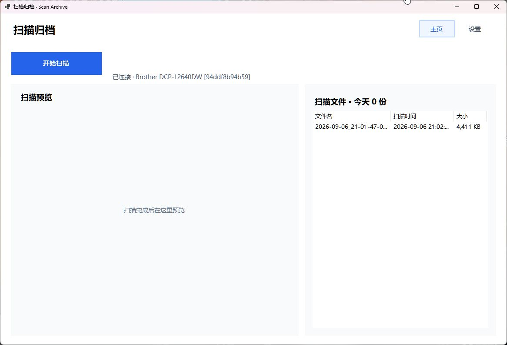

<h1 align="center">Scan Archive</h1>
<p align="center">Scan once. Keep the original. Let your document secretary make it findable.</p>
<p align="center"><strong>English</strong> · <a href="README.zh-CN.md">简体中文</a></p>
<p align="center">Windows · WIA / WIA 2.0 · OpenAI · Local document library</p>


## The application




A focused Windows scanning desk with PDF page navigation, accompanied by a responsive browser dashboard for your computer and local network. The interface is currently in Simplified Chinese.

## Why this exists

Paper piles up. Saving it takes effort; finding it again takes even more. I wanted to put a document in my printer's scanner, click once, and keep a useful digital copy without deciding on a filename and folder every time.

Scan Archive connects capture to a personal document library. An AI analysis step reads each page and saves detailed metadata before a separate secretary agent organizes the file. The ambition is a private knowledge base where a sentence can lead back to the actual document and page, while the original scan remains available.

## Run on Windows

Requirements: Windows x64, .NET 10 SDK to build, a WIA-compatible scanner driver, and an OpenAI API account for analysis and agent features. The published application includes its .NET runtime. Scanning and preview work without an API key.

```powershell
git clone https://github.com/Ha22yX/scan-archive.git
cd scan-archive
.\scripts\publish.ps1
.\dist\ScanArchive.exe
```

1. In the desktop settings, select your scanner, archive root, resolution and flatbed/feeder mode.
2. Open **http://localhost:5278**. On the service computer, create a password of at least 10 characters for the web dashboard.
3. Enter your OpenAI API key in desktop or web settings. The web settings also expose analysis/agent and embedding models, request limits and long-term instructions. Default models are `gpt-6-astra` and `text-embedding-3-large`; choose models your account supports.
4. Enable automatic organization and choose a daily wake time (default **05:00**, using Windows local time).
5. Scan. The desktop saves the capture to `Inbox`, then the background service analyzes every page, builds the index, and queues the secretary to organize it.

The service starts with the desktop application. You can also run `scripts/start-secretary.ps1`. Closing the scanner window leaves the service running. To opt into Windows sign-in startup, run `scripts/enable-startup.ps1`; use `-Disable` to remove it. The computer must be awake and the archive drive available. A missed daily review is caught up once when the service resumes; this is not a wake-from-sleep task or a pre-login Windows service.

### Local network access

Use `http://<computer-IP>:5278` from another device on the same LAN and sign in with the same password. The service binds to all interfaces by default. If blocked, run `scripts/enable-lan.ps1` from an **administrator PowerShell**; it permits TCP 5278 only on private networks from the local subnet. Do not forward this port to the internet. The default transport is HTTP, intended for a trusted private network; remote access requires an authenticated HTTPS gateway configured separately.

## From paper to a searchable library

| Stage | Behavior |
| --- | --- |
| Capture | Flatbed or native WIA 2.0 feeder; PDF/PNG/JPEG; driver-reported maximum scan area; timestamped capture name |
| Page analysis | OpenAI vision transcribes visible text and records detailed summaries, subjects, entities, dates, exact numbers, bilingual keywords and readability uncertainty |
| Document analysis | All pages contribute to a comprehensive document overview; long documents use grouped outlines rather than dropping later pages |
| Durable metadata | SQLite plus per-document JSON, including scan time, content hash, stable ID, original location, per-page analysis, model and analysis time |
| Organization | A separate tool-using agent chooses semantic folders and titles, can split independent documents into separate PDFs, and retains the original |
| Retrieval | Exact matches, SQLite FTS5 with Chinese bigrams, page-level overlapping chunks and OpenAI embeddings, combined with reciprocal-rank fusion |
| Agent search | Multiple complementary queries, reading the matching source pages, and clickable document/page citations; known analysis backlogs are disclosed |
| Daily review | Reviews library structure, names, index coverage and stored preferences; can reorganize categories or repair missing vectors |

The agent can inspect and search documents, read pages, create categories, move/rename files, merge categories, split PDF ranges, queue analysis, repair indexes, remember preferences and undo moves. Its tools operate within the configured library. Manual categorization locks a document against agent moves. File moves are journaled and reversible; source bytes are retained. Document contents are treated as evidence, not instructions.

### Storage and traceability

```text
Archive root/
  Inbox/                       # Newly captured/imported files
  Library/<AI categories>/     # Organized files; stable ID suffix avoids collisions
  .scanarchive-originals/      # Original bytes identified by SHA-256
  .scanarchive-metadata/       # One comprehensive JSON file per document ID
%LOCALAPPDATA%/ScanArchive/Secretary/
  library.db                   # Search index, metadata, jobs, conversations and audit trail
  settings.json                # Non-secret configuration
  openai.secret                # API key encrypted for the current Windows account
  outbox/                      # Durable capture notifications
```

The scan timestamp is separate from any date found in the document. Split children inherit that timestamp and retain the parent ID and original page range. Legacy date-folder files are discovered and can be reorganized; when no capture event exists, their filesystem creation time is used as a fallback, which may be inaccurate after copying. Exact byte duplicates share one document record. Metadata is available in the document details and as JSON beside the library; page checkpoints survive API failures.

**Back up both the archive root and the local Secretary data directory**, with the service stopped for a consistent database copy. Keeping originals on the same drive is recovery protection, not an independent backup. DPAPI secrets are bound to the Windows account: configure the API key again after migration. JSON exports preserve content and provenance, but a complete automated database restore from sidecars is not yet implemented.

## Implementation and verification

- Desktop: C# / .NET 10 WinForms, WIA, NAPS2.Wia, PDFsharp and Docnet/PDFium.
- Service: ASP.NET Core, SQLite/FTS5, plain JavaScript/CSS, no separate Node deployment.
- AI: official OpenAI Responses API with structured analysis and a bounded tool loop; embeddings stored with model provenance. `store:false` is used for Responses requests; scan content is still transmitted to OpenAI for processing.
- Reliability: durable job queue, per-page checkpoints, retry/backoff, daily request cap, lexical search when embeddings fail, recoverable move journal and protected original copies.
- Access: password authentication, HTTP-only same-site cookies, same-origin mutation checks, DPAPI-protected key storage. API keys are not returned by settings endpoints.

```powershell
dotnet test ScanArchive.Server.Tests -c Release
.\dist\ScanArchive.exe --self-test
```

Automated tests use synthetic PDFs and a mocked OpenAI transport. They cover analysis-before-organization, metadata persistence, Chinese/identifier retrieval, embedding outages, scan provenance after splitting, moves/undo, path boundaries, verified citations and daily scheduling. These tests do **not** measure real-model OCR or retrieval quality. Real API behavior, cost and document accuracy must be evaluated with your own key and representative scans. Handwriting, clipping and tiny text can still be misread; review important results against the page preview.

The semantic search implementation currently scores vectors in process; large libraries will eventually need a dedicated approximate-nearest-neighbor index. A request-count limit is not a dollar spending cap. The agent has a bounded number of tool steps per run, so very large reorganizations may need another wake-up.

## What comes next

- A real-document retrieval evaluation set with measured page-level recall.
- Better local OCR and selective high-resolution rereading for difficult pages.
- Document relationships, duplicate-scan history and richer knowledge-base navigation.
- Faster vector retrieval for large collections, full migration tooling and encrypted off-device backup.

The direction is simple: preserve paper faithfully, understand it usefully, and make the original easy to find again.
